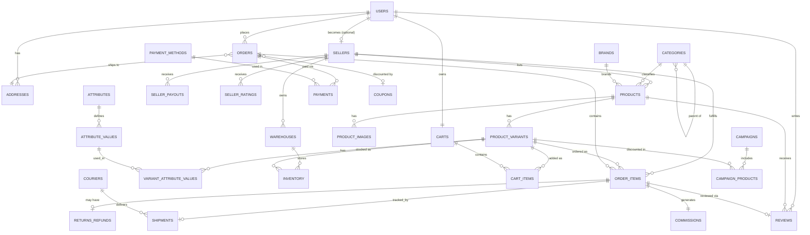

# Multivendor E-Commerce Database Design
### (Conceptually modeled on Daraz.com.bd — Academic Project)

> **Note on sourcing:** Daraz's actual production database schema is proprietary
> and not publicly available. This design is an original, from-scratch schema
> built to reflect the *observable functionality* of a large multivendor
> marketplace (multiple sellers, product variants, split orders, local payment
> methods, courier logistics, etc.). It is meant for learning / academic
> submission, not a reverse-engineered copy of any real company's database.

---

## 1. Design Goals

- Support **multiple independent sellers** operating shops on one platform.
- Support **product variants** (size, color, storage, etc.) with independent
  price/stock per variant.
- Support **multi-warehouse inventory** per seller.
- Allow **one customer order to span multiple sellers**, while each seller
  fulfills and gets paid for only their own items.
- Track the full commerce lifecycle: cart → order → payment → shipment →
  delivery → review, plus returns/refunds and seller payouts.

---

## 2. Entity Overview

| Module | Tables |
|---|---|
| Identity | `roles`, `users`, `addresses` |
| Seller management | `sellers`, `seller_documents`, `warehouses` |
| Catalog | `categories`, `brands`, `products`, `product_images`, `attributes`, `attribute_values`, `product_variants`, `variant_attribute_values` |
| Inventory | `inventory` |
| Shopping | `carts`, `cart_items`, `wishlists` |
| Marketing | `coupons`, `campaigns`, `campaign_products` |
| Orders | `orders`, `order_items` |
| Payments | `payment_methods`, `payments` |
| Logistics | `couriers`, `shipments` |
| Post-sale | `returns_refunds`, `reviews`, `seller_ratings` |
| Seller finance | `commissions`, `seller_payouts` |
| Engagement | `notifications` |

---

## 3. Key Design Decisions

**a) Order → Order Items → Seller (not Order → Seller directly)**
A single checkout can contain products from several sellers. Rather than
tying the whole order to one seller, each `order_item` row carries its own
`seller_id`. This is what lets Daraz-style platforms split one cart into
multiple seller shipments, track item-level status ("packed" for Seller A,
"shipped" for Seller B), and calculate commissions independently.

**b) Variants as the sellable unit, not the Product itself**
`products` describes the general listing (title, description, category).
`product_variants` is the actual purchasable SKU (e.g. "Red / XL"), each with
its own price, discount price, and stock. This mirrors how Daraz product
pages show a single listing with selectable color/size options that change
price and availability.

**c) Attributes as a flexible key-value system**
Rather than hardcoding `color` and `size` columns (which breaks for products
without those attributes, like books), `attributes` + `attribute_values` +
`variant_attribute_values` form a generic EAV-style pattern so any category
can define its own variant dimensions.

**d) Inventory decoupled from Product, tied to Variant + Warehouse**
Large sellers may stock the same SKU across multiple warehouses/fulfillment
centers. The `inventory` table is keyed on `(variant_id, warehouse_id)` so
stock can be tracked and reserved per location.

**e) Commission & Payout as first-class tables**
Because sellers get paid net of platform commission, `commissions` captures
the commission calculation per order item, and `seller_payouts` batches these
into periodic payouts — reflecting how marketplaces reconcile seller earnings.

**f) Local payment method support**
`payment_methods` is a lookup table (not an enum) so mobile financial
services like bKash/Nagad, cards, and Cash on Delivery can be added without
schema changes — reflecting the Bangladesh market Daraz.com.bd operates in.

---

## 4. Entity-Relationship Diagram

*(Rendered from the same relationships defined in `daraz_multivendor_schema.sql`.
Some 1-to-1/optional cardinalities are simplified for readability — see the SQL
file for exact constraints.)*

---

## 5. Example Business Flows Mapped to Tables

**Customer places an order with items from 2 sellers:**
`cart_items` → checkout creates one `orders` row → two `order_items` rows
(one per seller) → one `payments` row for the whole order → two `commissions`
rows (one per order_item) → two `shipments` rows (each seller ships
independently, possibly via different couriers).

**Seller adds a new product with color/size variants:**
`products` row created → `product_images` for gallery → `attribute_values`
picked for Color/Size → one `product_variants` row per combination (e.g.
Red/M, Red/L, Blue/M) → `variant_attribute_values` linking each variant to its
attribute values → `inventory` row per variant per warehouse.

**Customer requests a return:**
`returns_refunds` row created referencing the specific `order_item_id` →
on approval, `payments.status` or a new refund payment record reflects the
refund, and `commissions.net_payable` for that seller may be reversed.

---

## 6. Possible Extensions (mention in your report as "future work")

- Multi-currency support (separate `currencies` table + FX rate snapshots)
- Product Q&A section (`product_questions`, `product_answers`)
- Seller-level discount coupons vs. platform-wide coupons
- Live chat / support ticket tables
- Audit log tables for admin actions
- Search/analytics tables (search history, trending products)

---

## 7. Files Delivered

- `daraz_multivendor_schema.sql` — full CREATE TABLE DDL with primary keys,
  foreign keys, constraints, and recommended indexes.
- `database_design_documentation.md` — this file.
